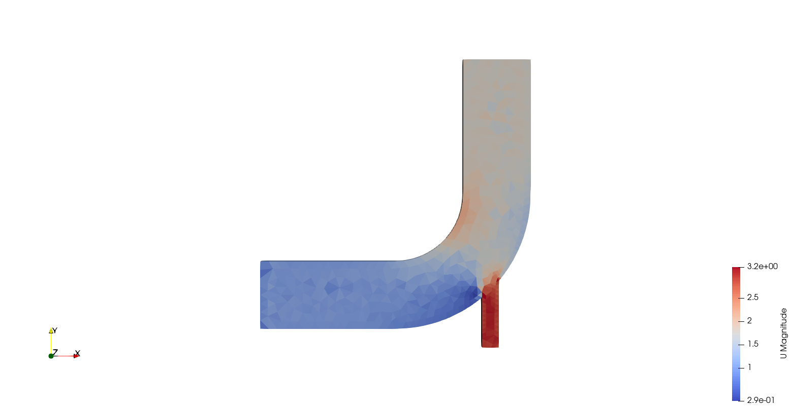
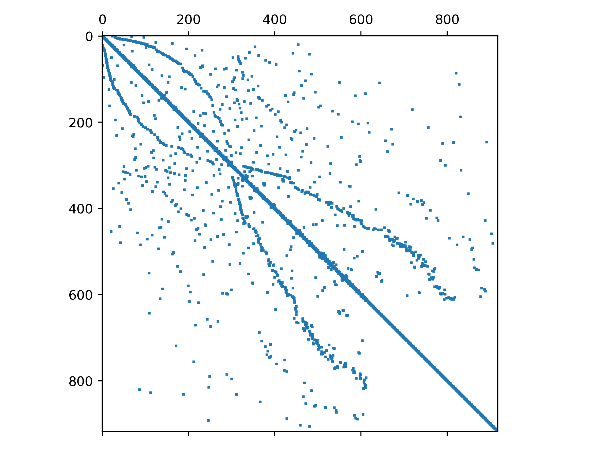

  <a href="https://github.com/iydon/foam2mtx">
    🟢⬜🟩⬜🟩 
    ⬜⬜⬜⬜⬜ 
    🟩⬜🟩⬜🟩 
    ⬜⬜⬜⬜⬜ 
    🟩⬜🟩⬜🟩 
  </a>

  <h3 align="center">foam2mtx</h3>

  

    Dump OpenFOAM matrix to mtx format (experimental)
  

## About the Project

This is an experimental sub-project to dump OpenFOAM matrix to matrix market format, which does not yet take into account boundary conditions, but is sufficient as a training set. Figure 1 shows the mixing elbow case that comes with the icoFoam solver, and Figure 2 shows a visualization of the dump Ux matrix at the first time step.

The following OpenFOAM versions are currently supported:

- OpenFOAM-7
- OpenFOAM-8
- OpenFOAM-9
- OpenFOAM-10

<figure>
  
  <figcaption>Figure 1<figcaption>
</figure>

<figure>
  
  <figcaption>Figure 2<figcaption>
</figure>
